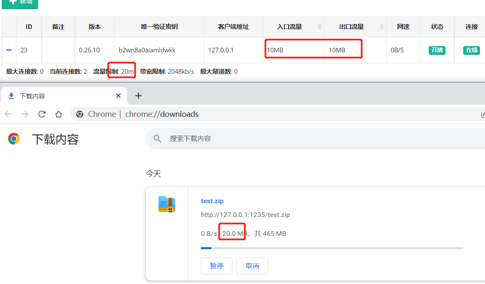

# NPS

[README](https://github.com/ehang-io/nps/blob/master/README.md)|[中文文档](https://github.com/ehang-io/nps/blob/master/README_zh.md)

# 说明
由于nps已经有二年多的时间没有更新了，存留了不少bug和未完善的功能。

此版本基于 nps 0.26.10的基础上二次开发而来。

***DockerHub***： [NPS](https://hub.docker.com/r/yisier1/nps) [NPC](https://hub.docker.com/r/yisier1/npc)

***宝塔面板***：[宝塔面板 Docker](docs/bt.md)

# 交流群
聊天灌水QQ群：770569342,619833483(已满)

# 公益云内网穿透
https://natnps.com/
公益NPS内网穿透服务，长期免费，6M带宽，3条隧道，不限流量，欢迎来嫖，自行注册账号。

# 特价云服务器  
国内BGP，游戏开服，2核 2G 15M上行 25元/月，[专属连接，首月5折](https://www.rainyun.com/MjY0MzY1_)

  
# 捐赠

## 提示
强烈推荐使用无配置文件模式启动客户端（删除掉npc.exe 目录下的`conf`文件夹即可），所有数据应该在服务端保存和配置，而客户端只做连接转发。客户端配置文件对小白极不友好，配置繁琐，容易出错。   
0.26.21 版本后的客户端，无需再通过命令行方式启动、安装、卸载客户端，直接双击运行，按照提示输入指令即可完成，非常方便。

## 更新日志  
- 2025-01-23  v0.26.22  
  优化：
  - 客户端注册系统服务时，（新版客户端注册方式，非 install 命令） 将按照 `npc-[vkey].log` 格式保存日志，每个客户端VKEY单独一个日志文件，windows 日志位于 `npc.exe` 同级目录下，linux 位于 `/var/log/`目录。  
  - 域名模式，HTTPS证书支持上传文件和文件路径，系统将自动识别路径还是证书内容。 [#175](https://github.com/yisier/nps/issues/175)  
  
  修复：
  - ipv6地址显示不全 [#237](https://github.com/yisier/nps/issues/237)
  

- 2025-01-07  v0.26.21   
  新增：
  - 客户端列表页面新增【快捷启动命令】，此命令为连接地址+链接秘钥的base64编码，方便一键启动、一键安装客户端。  
  - 域名解析和隧道列表增加访问地址，可以点击隧道链接，直接网页打开。 [#234](https://github.com/yisier/nps/issues/234)  
  
  优化：  
  - 修改vkey生成方式，由16位缩短至10位，截取uuid前10位，避免重复。  
  - 优化客户端启动方式，当npc文件目录下无配置文件时，可直接双击运行客户端，输入命令完成启动、安装、卸载客户端，直接启动和安装服务时需要输入【快捷启动命令】，卸载服务、启动服务、停止服务时，只需输入隧道秘钥【vkey】即可。安装服务以 nps-client-vkey 方式命名 ，实现注册多个服务。  
  
  

   **注意**  
   强烈推荐使用无配置文件模式启动客户端，所有数据应该在服务端保存和配置，而客户端只做连接转发。客户端配置文件对小白极不友好，配置繁琐，容易出错。

- 2024-11-07  v0.26.20  
  新增：
  - 客户端增加创建时间
  
  修复：
  - 客户端限速单位不统一 [#185](https://github.com/yisier/nps/issues/185)
  - 增加从下拉选择客户端,隧道列表排序,新增编辑后不会刷新界面 [#183](https://github.com/yisier/nps/issues/183)
  - 隧道数量限制无法统计域名映射 [#209](https://github.com/yisier/nps/issues/209) 
  

- 2024-06-01  v0.26.19  
  - golang 版本升级到 1.22.
  - 增加自动https，自动将http 重定向（301）到 https.  
  - 客户端命令行方式启动支持多个隧道ID，使用逗号拼接，示例：`npc -server=xxx:8024 -vkey=ytkpyr0er676m0r7,iwnbjfbvygvzyzzt` .
  - 移除 nps.conf 参数 `https_just_proxy` , 调整 https 处理逻辑，如果上传了 https 证书，则由nps负责SSL (此方式可以获取真实IP)，
      否则走端口转发模式（使用本地证书,nps 获取不到真实IP）， 如下图所示。    
    

- 2024-02-27  v0.26.18  
  ***新增***：nps.conf 新增 `tls_bridge_port=8025` 参数，当 `tls_enable=true` 时，nps 会监听8025端口，作为 tls 的连接端口。  
             客户端可以选择连接 tls 端口或者非 tls 端口： `npc.exe  -server=xxx:8024 -vkey=xxx` 或 `npc.exe  -server=xxx:8025 -vkey=xxx -tls_enable=true`
  
  
- 2024-01-31  v0.26.17  
  ***说明***：考虑到 npc 历史版本客户端众多，版本号不同旧版本客户端无法连接，为了兼容，仓库版本号将继续沿用 0.26.xx

- 2024-01-02  v0.27.01  (已作废，功能移动到v0.26.17 版本)  
  ***新增***：tls 流量加密，(客户端忽略证书校验，谨慎使用，客户端与服务端需要同时开启，或同时关闭)，使用方式：   
             服务端：nps.conf `tls_enable=true`;    
             客户端：npc.conf `tls_enable=true` 或者 `npc.exe  -server=xxx -vkey=xxx -tls_enable=true`  

  
- 2023-06-01  v0.26.16  
  ***修复***：https 流量不统计 Bug 修复。  
  ***新增***：新增全局黑名单IP，用于防止被肉鸡扫描端口或被恶意攻击。  
  ***新增***：新增客户端上次在线时间。

- 2023-02-24  v0.26.15  
  ***修复***：更新程序 url 更改到当前仓库中   
  ***修复***：nps 在外部路径启动时找不到配置文件  
  ***新增***：增加 nps 启动参数，`-conf_path=D:\test\nps`,可用于加载指定nps配置文件和web文件目录。  
  ***window 使用示例：***  
  直接启动：`nps.exe -conf_path=D:\test\nps`  
  安装：`nps.exe install -conf_path=D:\test\nps`    
  安装启动：`nps.exe start`      

  ***linux 使用示例：***    
  直接启动：`./nps -conf_path=/app/nps`  
  安装：`./nps install -conf_path=/app/nps`  
  安装启动：`nps start -conf_path=/app/nps`  

- 2022-12-30  v0.26.14  
  ***修复***：API 鉴权漏洞修复

- 2022-12-19  
***修复***：某些场景下丢包导致服务端意外退出  
***优化***：新增隧道时，不指定服务端口时，将自动生成端口号  
***优化***：API返回ID, `/client/add/, /index/addhost/，/index/add/ `   
***优化***：域名解析、隧道页面，增加[唯一验证密钥]，方便搜查  

- 2022-10-30   
***新增***：在管理面板中新增客户端时，可以配置多个黑名单IP，用于防止被肉鸡扫描端口或被恶意攻击。  
***优化***：0.26.12 版本还原了注册系统功能，使用方式和以前一样。无论是否注册了系统服务，直接执行 nps 时只会读取当前目录下的配置文件。

- 2022-10-27  
***新增***：在管理面板登录时开启验证码校验，开启方式：nps.conf `open_captcha=true`，感谢 [@dongFangTuring](https://github.com/dongFangTuring) 提供的PR  

  
- 2022-10-24:     
***修复***：HTTP协议支持WebSocket(稳定性待测试)
  

- 2022-10-21:   
***修复***：HTTP协议下实时统计流量，能够精准的限制住流量（上下行对等）  
***优化***：删除HTTP隧道时，客户端已用流量不再清空

- 2022-10-19:  
***BUG***：在TCP协议下，流量统计有问题，只有当连接断开时才会统计流量。例如，限制客户端流量20m,当传输100m的文件时，也能传输成功。  
***修复***：TCP协议下实时统计流量，能够精准的限制住流量（上下行对等）  
***优化***：删除TCP隧道时，客户端已用流量不再清空

- 2022-09-14:  
修改NPS工作目录为当前可执行文件目录（即配置文件和nps可执行文件放在同一目录下，直接执行nps文件即可），去除注册系统服务，启动、停止、升级等命令

